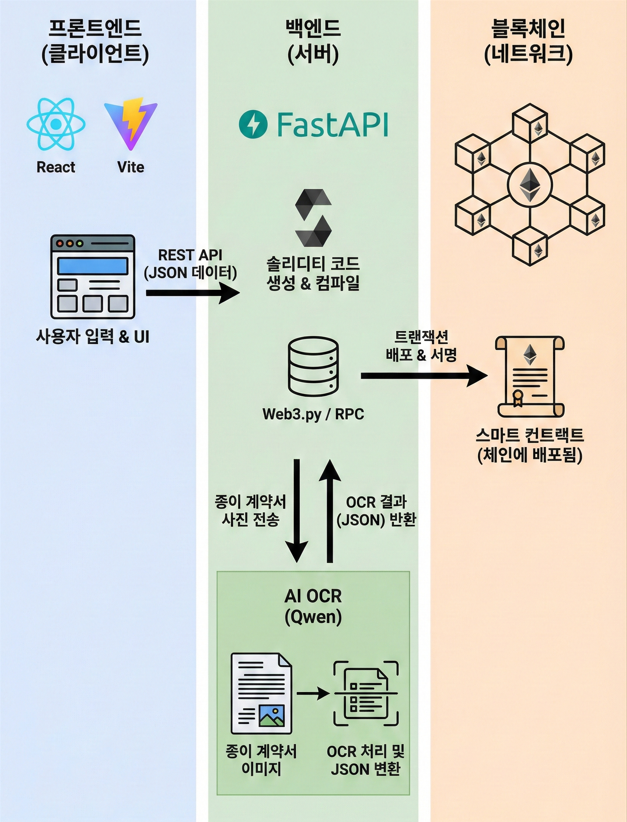
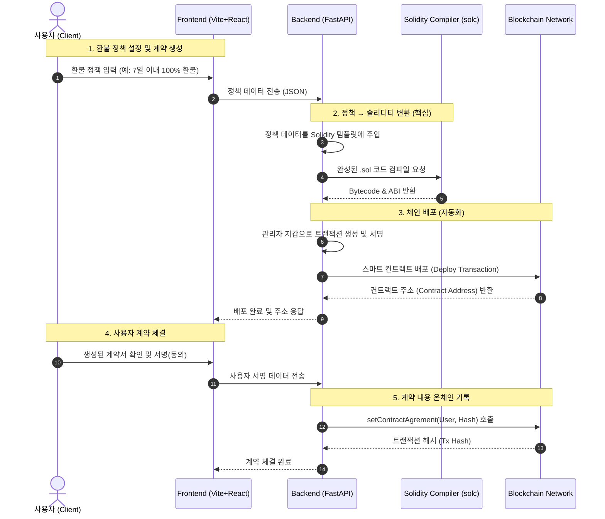

# 1. 문제 정의

## 운동만 열심히 하고 싶은데, 헬스장이 사라질까 봐 걱정부터 해야 해요.

헬스장, 독서실, 학원처럼 이용권을 판매하는 사업체에서는 고객이 먼저 비용을 지불하고, 서비스는 나중에 제공됩니다. 대부분의 이용권에는 환불 규정이 명시되어 있습니다. 하지만 이용권을 구매한 뒤 얼마 지나지 않아 사업체가 파산하거나 폐업한다면, 그 환불 규정은 더 이상 의미가 없어집니다.

기존의 결제 및 이용권 구조에도 헬스장이 파산했을 경우 환불을 해야 한다는 법적 근거, 즉 **규칙**은 존재합니다. 하지만 이 규칙은 어디까지나 지켜야 하는 의무일 뿐, 현실에서는 반드시 **실현**되는 것은 아닙니다.

사업자가 환불을 거부, 즉 규칙 자체를 무시할 수도 있습니다.

이때 규칙을 실현하기 위해서 고객은

- 소송이나 분쟁 조정을 진행해야 하고
- 시간과 비용을 들여 자신의 권리를 입증해야 하며
- 그 과정에서 큰 금전적,심리적 부담을 감수해야 합니다.

즉, 현재의 시스템은 규칙이 반드시 실현되는 구조가 아닙니다.

---

# 2. BlockPass의 솔루션: 블록체인+스마트 컨트랙트

블록체인은 계약과 거래 기록을 특정 회사나 서버가 아니라, 여러 곳에 동시에 저장해 **누구도 임의로 고치거나 지울 수 없게 만드는 기술**입니다.

스마트 컨트랙트는 그 위에서 작동하는 **자동 실행 프로그램**이에요. 전통적인 금전 계약은 체결되었더라도 이행은 사람이 직접 해야했지만, 스마트 컨트랙트는 미리 정해진 조건이 충족되면 사람의 승인이나 판단 없이 약속된 결과를 **코드의 로직 그대로 자동 실행**합니다.

BlockPass는 이 스마트 컨트랙트를 이용해 환불 등의 규칙을 코드로 고정하고, 누군가의 선택이나 사후 절차에 의존하지 않고 **조건이 맞으면 반드시 환불이 실행되도록** 만듭니다.

---

## 계약서 어디갔지? → 계약서를 블록체인에 기록해요.

BlockPass에서는 이용권 계약과 환불 규정을 블록체인에 기록합니다.

- 계약이 언제, 어떤 조건으로 체결됐는지
- 환불 규정이 어떻게 설정되어 있는지

등을 기록합니다. 이 정보는 블록체인에 저장되어 누구도 임의로 수정하거나 삭제할 수 없습니다. 계약은 더 이상 서버나 회사 내부 문서에만 존재하지 않습니다.

---

## 어차피 파산했는데 먹튀해도 괜찮겠지? → 파산 시 환불을 스마트 컨트랙트로 무조건 실현해요.

BlockPass에서는 환불 조건이 **스마트 컨트랙트**로 만들어집니다.

- 헬스장 사장님은 ‘이용 기간의 몇 % 이전에는 몇 % 환불’과 같은 규칙을 직접 설정하고
- 이 규칙은 Solidity 코드로 변환되어 블록체인에 배포됩니다.

한 번 배포된 스마트 컨트랙트는 고객도, 사업자도, 이 서비스를 제공하는 우리 Blockpass도 임의로 수정할 수 없습니다.

결제, 환불 등은 고객, 사업자, 은행 등의 주체가 실행하는 것이 아니라, 스마트 컨트랙트 코드에 명시된 조건문에 따라 프로그램처럼 실행돼요. 즉, 계약 배포 이후에는 그 누구의 주관도 개입할 수 없어요.

---

## 누군가 사라져도 계약은 실행돼요.

헬스장이 폐업하거나, 심지어 우리 BlockPass가 서비스를 중단하더라도 스마트 컨트랙트는 블록체인 위에 그대로 남아 작동합니다.

- 사업자가 없어져도
- 운영 주체가 바뀌어도

고객은 설정된 규정에 따라 환불을 받게 됩니다.

---

# 3. 기술 스택

## 아키텍처 다이어그램

## 구체적인 시퀀스 다이어그램

