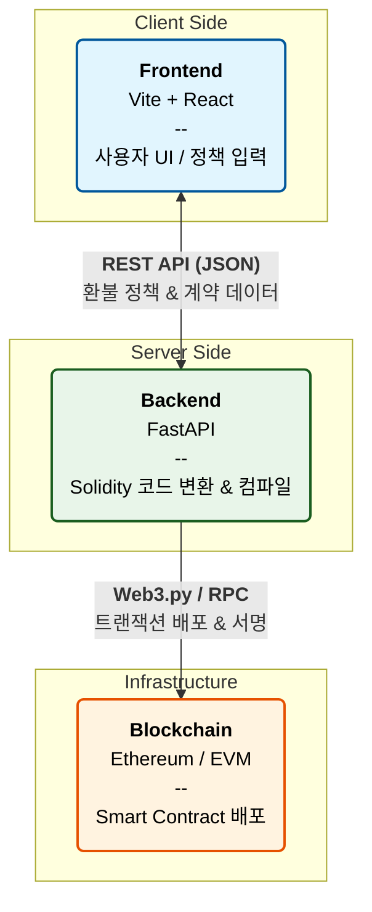
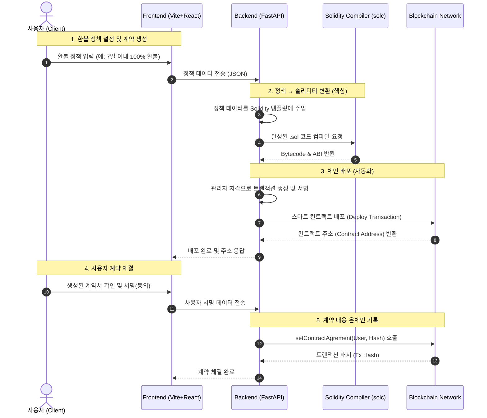

# 1. 문제 정의

## 운동만 열심히 하고 싶은데, 헬스장이 사라질까 봐 걱정부터 해야 해요.

헬스장, 독서실, 학원처럼 이용권을 판매하는 사업체에서는 고객이 먼저 비용을 지불하고, 서비스는 나중에 제공됩니다. 대부분의 이용권에는 환불 규정이 명시되어 있습니다.

하지만 이용권을 구매한 뒤 얼마 지나지 않아 사업체가 파산하거나 폐업한다면, 그 환불 규정은 더 이상 의미가 없어집니다.

- 연락할 수 있는 담당자는 없고
- 환불을 처리할 주체도 사라지며
- 남은 이용권은 그대로 손실이 됩니다

이용자는 계약을 맺었지만,

정작 계약이 **실행될 수 없는 상황**에 놓이게 됩니다.

---

## 문제는 특정 주체의 ‘양심’에 의존하는 구조에 있어요.

기존 이용권 환불 구조에서는

환불이 시스템으로 보장되지 않습니다.

- 사장님이 끝까지 책임지기를 기대하고
- 회사가 파산하지 않기를 바라며
- 문제가 생기지 않기를 운에 맡깁니다

환불 규정은 분명 존재하지만,

이를 **반드시 지켜야 할 기술적 장치**는 없습니다.

그래서 같은 문제가 반복됩니다.

- 폐업 직전까지 이용권 판매
- 환불 약속은 문서에만 남음
- 피해는 항상 이용자에게 돌아감

이건 개인의 부주의 문제가 아니라,

**환불을 강제할 수 없는 구조적인 문제**입니다.

---

# 2. BlockPass의 새로운 접근법

BlockPass는 이 문제를 ‘사람을 믿는 방식’이 아니라 블록체인을 통해 **시스템으로 보장하는 방식**으로 해결합니다.

---

## 계약서를 블록체인에 기록해요.

BlockPass에서는 이용권 계약과 환불 규정을 블록체인에 기록합니다.

- 계약이 언제, 어떤 조건으로 체결됐는지
- 환불 규정이 어떻게 설정되어 있는지

이 정보는 블록체인에 저장되어 누구도 임의로 수정하거나 삭제할 수 없습니다. 계약은 더 이상 서버나 회사 내부 문서에만 존재하지 않습니다.

---

## 환불 규정의 준수를 특정 주체의 ‘양심’에 맡기지 않아요.

환불 규정은 사람이 판단하고 처리하지 않습니다. BlockPass에서는 환불 조건이 **스마트 컨트랙트**로 만들어집니다.

- 헬스장 사장님은 ‘이용 기간의 몇 % 이전에는 몇 % 환불’과 같은 규칙을 직접 설정하고
- 이 규칙은 코드로 변환되어 블록체인에 배포됩니다

한 번 배포된 스마트 컨트랙트는

- 헬스장 사장님도
- BlockPass 회사도
- 그 누구도 임의로 수정할 수 없습니다

조건이 충족되면, 환불은 **반드시 자동으로 실행**됩니다.

---

## 누가 사라져도 계약은 실행돼요.

헬스장이 폐업하거나, 심지어 우리 BlockPass가 서비스를 중단하더라도 스마트 컨트랙트는 블록체인 위에 그대로 남아 작동합니다.

- 사업자가 없어져도
- 운영 주체가 바뀌어도

환불 조건이 만족되면 이용자는 설정된 규정에 따라 환불을 받게 됩니다. 환불은 더 이상 요청이나 협의의 대상이 아닙니다. **이미 정해진 결과**입니다.

---

# 3. 기술 스택

## 아키텍처 다이어그램

## 구체적인 시퀀스 다이어그램

